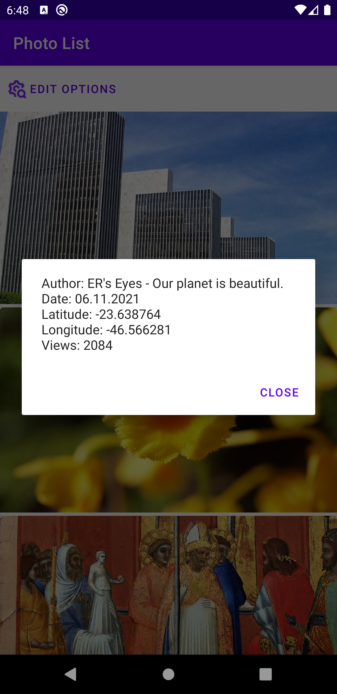
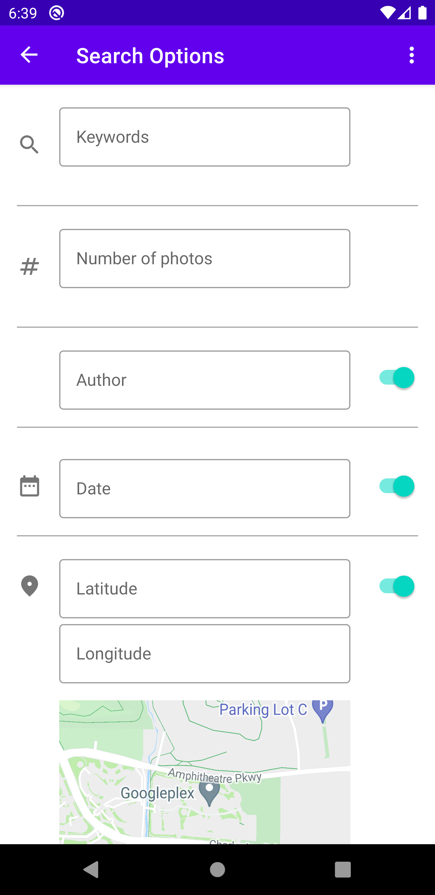
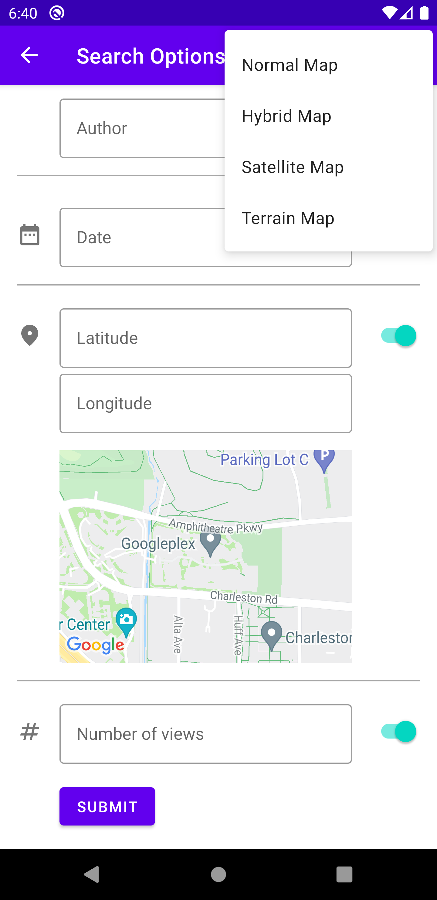
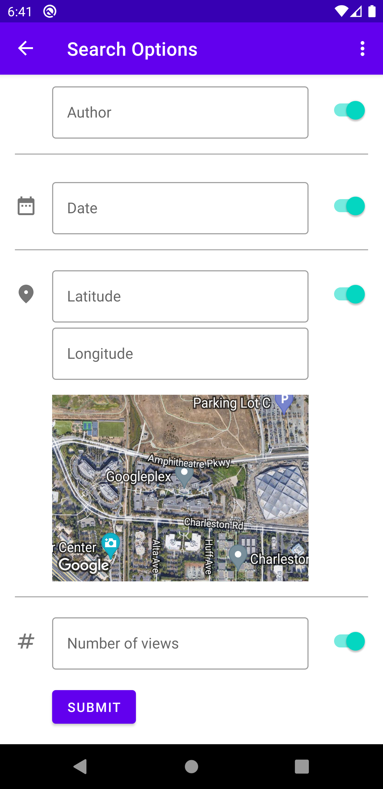

# FlickReranker

FlickReranker is a sample Android app that lists photos from the [Flickr website](https://www.flickr.com/) sorted by the similarity of their metadata (location, date, number of views etc.) to the metadata specified by the user.

Note: see my new project [Pixabay-android](https://github.com/TheyCallMeLuke/pixabay-android) that fetches photos from a different API. The UI and UX design is superior to this one and the code is better structured and more readable.

## Screenshots

List of photos             |  Photo details
:-------------------------:|:-------------------------:
  |  

Search options A             |  Search options B |  Search options C
:-------------------------:|:-------------------------:|:-------------------------:
 |  | 

## Features

* Search images hosted on Flickr
* Specify the desired image metadata (keywords, number of images, author, date, geo location, number of views)
* Choose date with a date picker
* Choose geo location with Google Maps
* Change map types (normal, hybrid, satellite, terrain)

## Tech Stack

* Support for Android 21+
* Fully Kotlin
* Uses [Flickr](https://www.flickr.com/) to fetch images, accessed through [their API](https://www.flickr.com/services/)
* [Architecture components](https://developer.android.com/topic/libraries/architecture) (LiveData, ViewModels, Navigation)
* [Koin](https://insert-koin.io/) for dependency injection
* [Retrofit](https://github.com/square/retrofit) to aid with API communicaton
* [Moshi](https://github.com/square/moshi) for parsing JSON
* [Coroutines](https://github.com/Kotlin/kotlinx.coroutines) to perform async tasks
* [Coil](https://github.com/coil-kt/coil) for async image loading
* [Google Maps](https://developers.google.com/maps) for integrating Google Maps

## Patterns
* MVVM Pattern
* Repository Pattern
