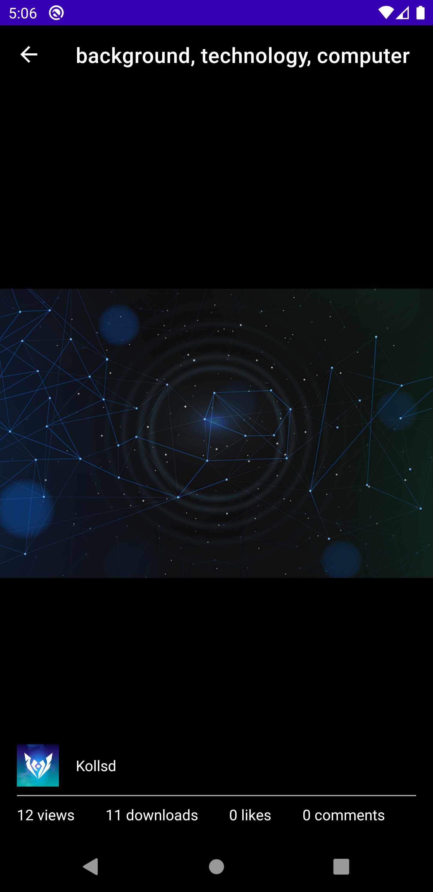

# Pixabay-android

Pixabay-android is an Android app for searching images hosted on the [Pixabay website](https://pixabay.com/).

## Screenshots

Recent photos             |  Photo details A
:-------------------------:|:-------------------------:
  |  

Photos searched by keywords             |  Photo details B
:-------------------------:|:-------------------------:
 | 

## Features

* Search recent images hosted on Pixabay
* Search images by keywords
* List image details, e.g. tags, author, number of views, number of downloads, number of likes, number of comments

## Tech Stack

* Support for Android 21+
* Fully Kotlin
* Uses [Pixabay](https://pixabay.com/) to fetch images, accessed through [their API](https://pixabay.com/api/docs/)
* [Architecture components](https://developer.android.com/topic/libraries/architecture) (LiveData, ViewModels, Navigation)
* [Koin](https://insert-koin.io/) for dependency injection
* [Retrofit](https://github.com/square/retrofit) to aid with API communicaton
* [Moshi](https://github.com/square/moshi) for parsing JSON
* [Coroutines](https://github.com/Kotlin/kotlinx.coroutines) to perform async tasks
* [Coil](https://github.com/coil-kt/coil) for async image loading

## Patterns
* Clean Architecture
* MVVM Pattern
* Repository Pattern
